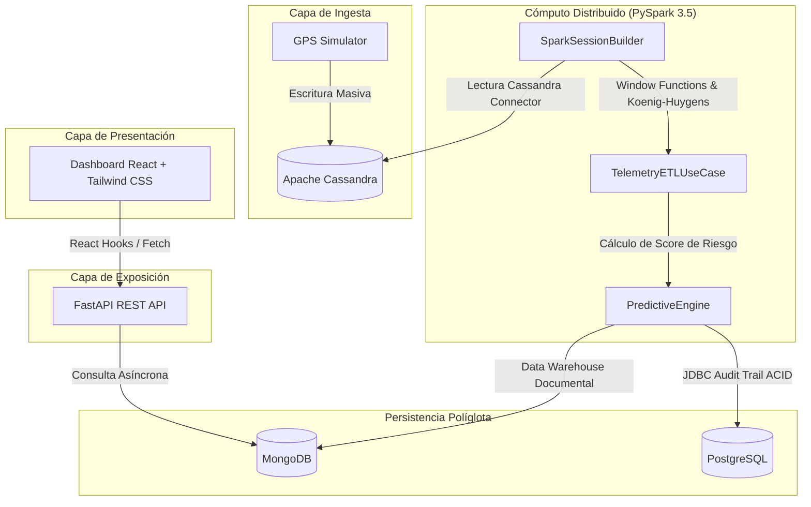

# SmartFleet Pro v2.0 - Centro de Inteligencia de Flota

Plataforma distribuida de alta disponibilidad para la ingesta políglota a gran escala y el análisis analítico de telemetría en tiempo real, utilizando una arquitectura desacoplada y reactiva consumida en caliente mediante React Hooks.

---

## 1. Arquitectura del Sistema y Clean Code

La base de código está estructurada dentro del directorio [src/](file:///d:/UTP_Sistemas/CICLO%206/Base%20de%20Datos%20II/SmartFleet/src) bajo principios estrictos de **Clean Architecture** y separación de responsabilidades modulares:

* **[src/backend/](file:///d:/UTP_Sistemas/CICLO%206/Base%20de%20Datos%20II/SmartFleet/src/backend)**: Alberga el núcleo ejecutable del backend, la API REST asíncrona, y la integración de repositorios.
* **[src/engines/](file:///d:/UTP_Sistemas/CICLO%206/Base%20de%20Datos%20II/SmartFleet/src/backend/engines)**: Motores de cálculo analítico y predictivo distribuido.
* **[src/frontend/](file:///d:/UTP_Sistemas/CICLO%206/Base%20de%20Datos%20II/SmartFleet/src/frontend)**: Aplicación SPA reactiva desacoplada y compilada estáticamente para producción.

### Principios de Diseño
* **SOLID**: Estricto cumplimiento de principios SOLID, destacando la **Inversión de Dependencias (DI)** mediante inyección de adaptadores e interfaces de repositorio en los constructores de los casos de uso.
* **Separación de Capas**: Desacoplamiento absoluto entre las capas de:
  * **Domain**: Definiciones de entidades y abstracciones puras sin dependencias externas.
  * **Usecases**: Lógica de aplicación que coordina el flujo de datos.
  * **Infrastructure**: Implementación concreta de tecnologías (Cassandra, MongoDB, Postgres, Spark JDBC).
* **Repository Pattern**: Abstracción completa de las operaciones de lectura y escritura de almacenamiento NoSQL y SQL mediante contratos de interfaz definidos en Domain.

### Core Matemático: Global Risk Score
El cálculo del índice de riesgo predictivo utiliza el **Teorema de Koenig-Huygens** para computar la varianza física de aceleración en un solo paso $O(N)$, minimizando la sobrecarga computacional del clúster de Spark y mitigando la pérdida de precisión:

$$\text{Var}(X) = E[X^2] - (E[X])^2$$

El pipeline aplica **Double Precision Casting** en JVM/Spark a fin de evitar colisiones numéricas de telemetría de alta frecuencia (miliseundos) y previene errores críticos de división por cero mediante un manejo defensivo de varianza de aceleración.



---

## 2. Stack Tecnológico Políglota

| Componente | Tecnología | Propósito en la Arquitectura |
| :--- | :--- | :--- |
| **Frontend** | React y Tailwind CSS | Interfaz reactiva SPA optimizada con Splash Screen UX de alta fidelidad. Bundle final purgado y minimizado a ~24 KB. |
| **Backend API** | FastAPI y Uvicorn | Exposición REST desacoplada, enrutamiento asíncrono asíncrono nativo y alto rendimiento de concurrencia. |
| **Big Data Engine** | PySpark 3.5 (JVM) | Procesamiento paralelo distribuido y transformaciones matemáticas de series temporales masivas. |
| **Almacenamiento ACID** | PostgreSQL | Persistencia relacional transaccional para bitácoras históricas y auditorías de seguridad operacional. |
| **Capa NoSQL Temporal** | Apache Cassandra | Data Lake analítico de alta velocidad de escritura optimizado para la ingesta masiva de series temporales de GPS. |
| **Capa NoSQL Documental** | MongoDB | Almacén analítico consolidado (Data Warehouse) con esquemas BSON flexibles para el perfilado dinámico de vehículos. |
| **Orquestación** | Docker y Docker Compose | Contenerización completa y enlace de red privada aislada resuelta mediante DNS interno de servicios. |

---

## 3. Instalación y Despliegue en 1-Click

### Requisitos Previos
* **Docker Desktop** instalado y activo en el sistema.

### Inicialización del Clúster
Clona el repositorio, accede al directorio del proyecto y levanta todo el clúster políglota y los servicios en segundo plano ejecutando:

```bash
docker-compose up -d --build
```

### Mapeo de Puertos y Servicios Locales
Una vez iniciada la red interna, puedes verificar la accesibilidad en las siguientes rutas del Host local:

* **Dashboard de Presentación**: [http://localhost:8501](http://localhost:8501)
* **Documentación Interactiva de la API**: [http://localhost:8000/docs](http://localhost:8000/docs)
* **Endpoint de Analítica de Flota**: [http://localhost:8000/api/v1/fleet/analytics](http://localhost:8000/api/v1/fleet/analytics)

---

## 4. Pipeline de Desarrollo en Caliente

Gracias al mapeo de volúmenes en caliente (`- .:/app`) configurado en los contenedores de Docker, cualquier cambio en los archivos fuente del Host se refleja en tiempo real. 

Si realizas modificaciones visuales en el código del Frontend (archivos JSX en `src/frontend/src`), ejecuta la siguiente secuencia en tu máquina local para recompilar el bundle final y reiniciar la visualización:

```bash
# 1. Compilar los recursos transpilados y purgados
npm --prefix src/frontend run build

# 2. Reiniciar el servidor estático en caliente
docker-compose restart app_frontend
```

---

## Créditos

Desarrollado con estándares Enterprise por **Juan José Parra Terrel**.
